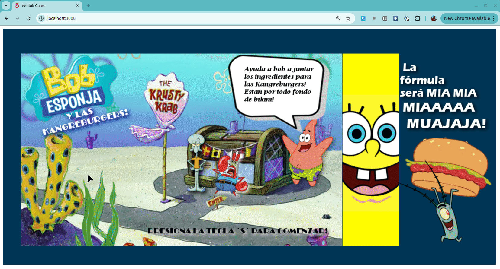

# Bob Esponja Game
 

Juego desarrollado por estudiantes (2016), corregido y adaptado por docentes (2019).

### Instrucciones de juego

La pantalla inicial presenta la temática, y se pasa al juego propiamente dicho. Allí tenés que conseguir formar 3 kangreburgers con sus ingredientes, que están a la derecha, evitando chocarte con el malvado señor Plankton. Para tomar los ingredientes, primero tenés que capturar la espátula por única vez.

